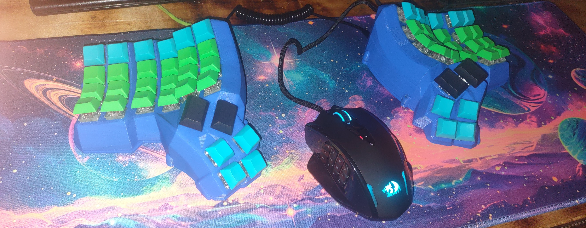
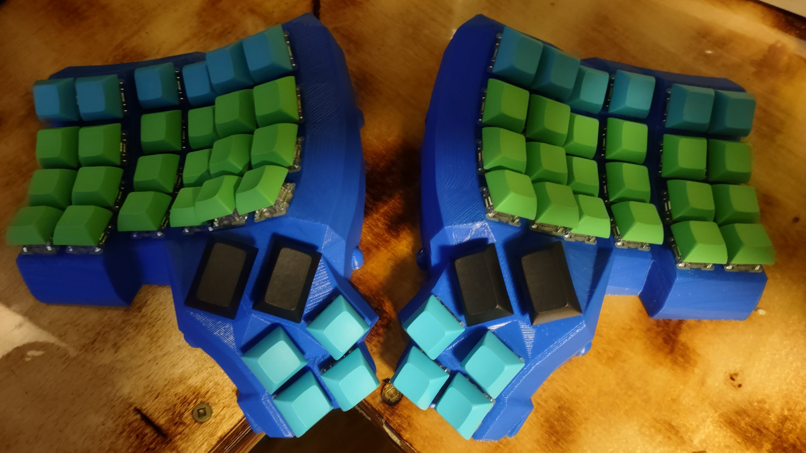
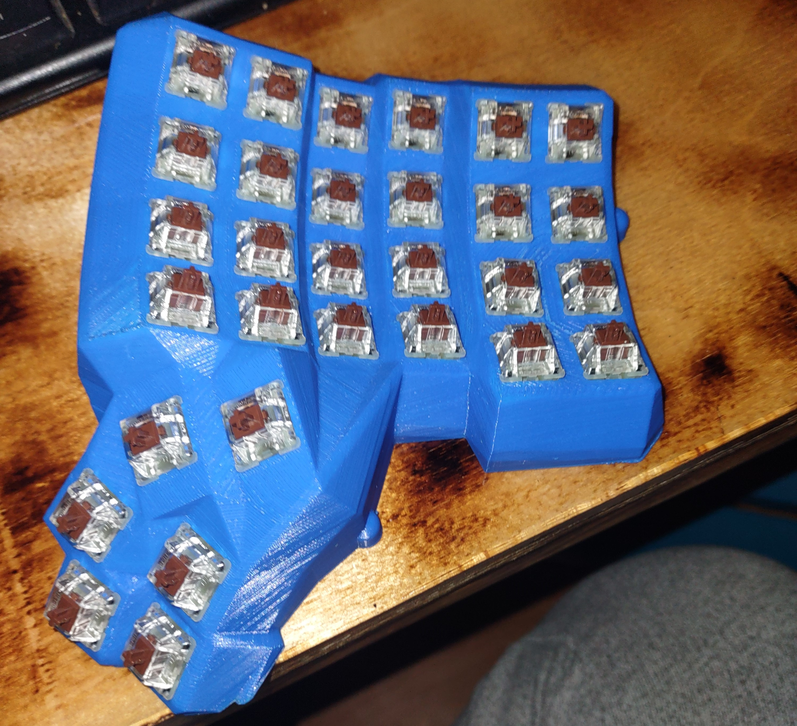
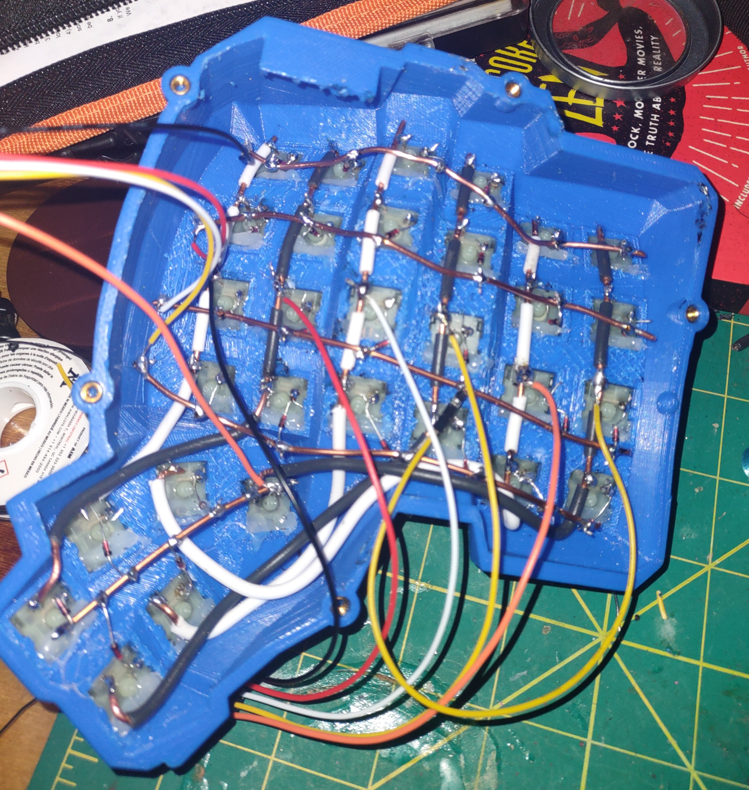
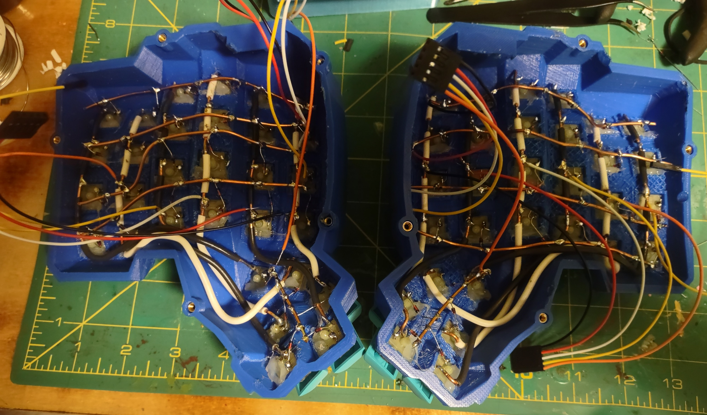
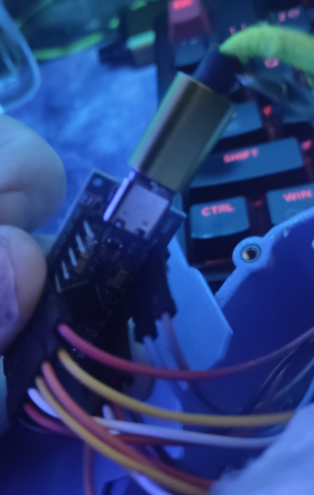
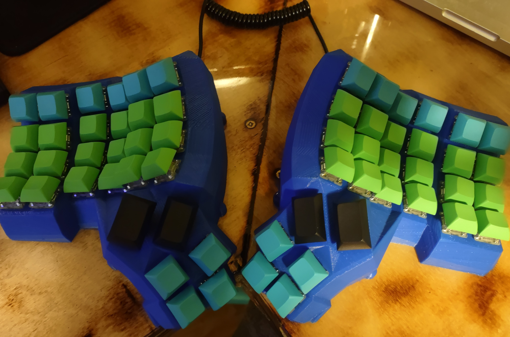
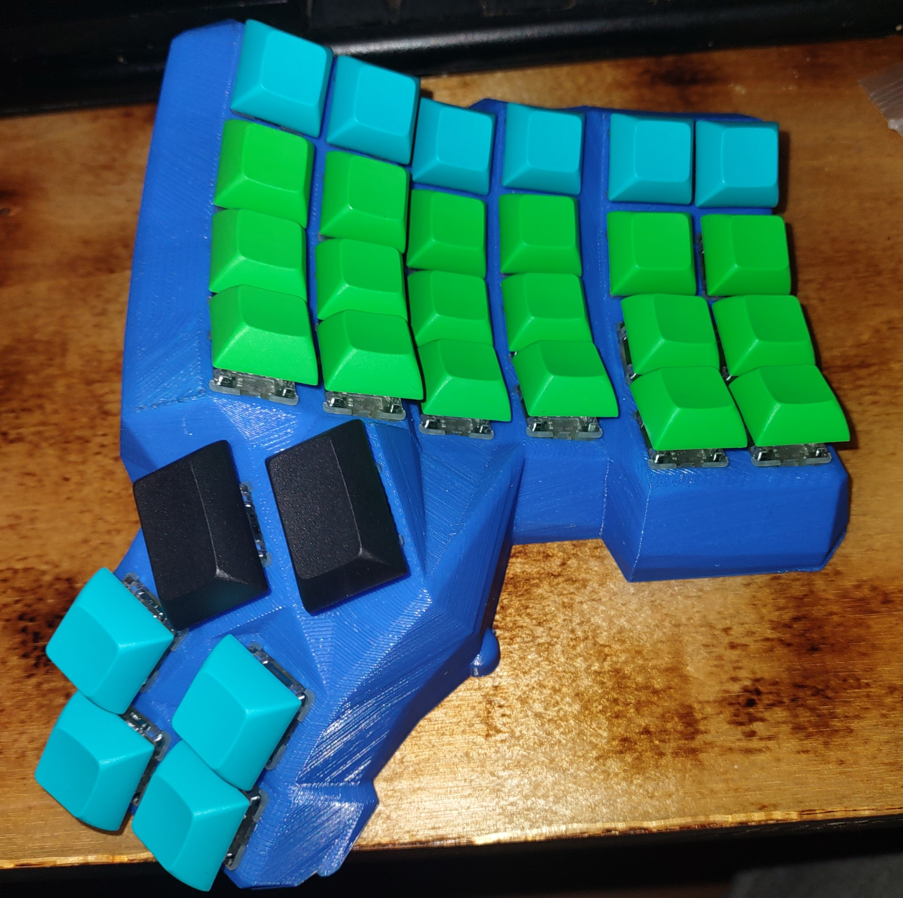

# Dactyl Manuform 6x4 - Hand-Wired Build Log

> A fully hand-wired, QMK-powered split ergonomic keyboard. 3D printed shell, brown switches, coiled TRRS interconnect. Built from scratch.



---

## Table of Contents

- [Overview](#overview)
- [Parts List](#parts-list)
- [3D Printing the Shell](#3d-printing-the-shell)
- [Switch Installation](#switch-installation)
- [Hand Wiring the Matrix](#hand-wiring-the-matrix)
- [Controller Wiring](#controller-wiring)
- [QMK Firmware](#qmk-firmware)
- [Keycaps](#keycaps)
- [Results](#results)

---

I wanted a split ergonomic keyboard and decided to build one instead of buying one. I used my 3D modeling and printing background, electrical skills, and a lot of research to pull it together. Parts sourced from AliExpress, everything else I already owned. Hope it inspires someone to build something they can actually use.

## Overview

The Dactyl Manuform is a parametric, sculpted split keyboard based on the Dactyl (which itself derives from the Kinesis Advantage). The Manuform variant modifies the thumb cluster for a more natural angle.

This build is a **6x4** layout - 6 columns, 4 rows per half - with a **6-key thumb cluster** (2 large + 4 small keys) per side. Total key count: **~92 keys** across both halves.

**Key specs:**


| Property   | Value                            |
| ---------- | -------------------------------- |
| Layout     | 6x4 + 6 thumb keys per half      |
| Shell      | FDM 3D printed (PLA, blue)       |
| Switches   | Cherry MX Brown                  |
| Diodes     | 1N4148, through-hole             |
| Controller | Pro Micro (ATmega32U4)           |
| Firmware   | QMK                              |
| Connection | Wired, TRRS coiled cable         |
| Keycaps    | DSA profile - green, teal, black |

---

## Parts List


| Part                             | Qty    | Notes                                                   |
| -------------------------------- | ------ | ------------------------------------------------------- |
| Cherry MX Brown switches         | ~92    | One per key                                             |
| 1N4148 diodes                    | ~92    | One per switch                                          |
| Controller (Pro Micro / Elite-C) | 2      | One per half                                            |
| TRRS jacks                       | 2      | For half-to-half connection                             |
| TRRS cable (coiled)              | 1      | Connects left/right halves                              |
| USB cable                        | 1      | Host side only                                          |
| 22–28 AWG wire                  | -      | Solid core preferred for rows; stranded for column runs |
| PLA filament                     | ~500g  | Blue, two shells                                        |
| 5-pin connectors (JST/Dupont)    | 2 sets | Controller-to-harness detachable connection             |
| M3 screws + inserts              | ~16    | Case assembly                                           |
| Keycaps (MX stem)                | ~92    | DSA or XDA profile                                      |

---

## 3D Printing the Shell

The shell was generated using the [Dactyl Manuform generator](https://github.com/abstracthat/dactyl-manuform). Parameters were customized based on direct hand measurements - column stagger, tenting angle, and thumb cluster position were all adjusted to fit rather than using the defaults. The generator's documentation walks through what each parameter controls; taking the time to measure your hand span, finger lengths, and natural thumb arc before generating is worth it.

Exact parameter values weren't retained, but the process was: read the docs, measure, do the math, generate, iterate.

**Print settings used:**

- Printer: Creality Ender 3 (tuned - bed leveling dialed, custom settings)
- Slicer: Cura / Creality Slicer
- Layer height: 0.2mm
- Infill: 100% - needed to hold switch snap-fit tension without flexing
- Supports: Minimal, with zipper seam placement for clean removal
- Material: PLA
- Color: Blue

The two halves print separately. The thumb cluster is integrated into each half.



---

## Switch Installation

Switches press into the key wells with an MX-standard snap fit. The Dactyl Manuform shell is parametrically sized for MX footprint switches.

1. Press each switch in from the top - you should feel/hear a click as the tabs seat
2. Verify switch is flush and square before moving on
3. Check that the pins are not bent - bent pins are the #1 cause of dead keys



---

## Hand Wiring the Matrix

This is the most time-consuming part of the build. Each switch connects to a **row wire** and a **column wire**, with a **diode** on each switch to prevent ghosting.

### Diode orientation

Diodes go **cathode toward the row wire** (black band toward the row). All diodes on the same row connect at their cathodes.

### Wire source

All wire in this build is **electrical housing wire offcuts** - scrap solid-core copper pulled from the bin. Free, stiff enough to hold shape, and the insulation strips cleanly.

### Row wiring (insulated wire, strip-at-joint technique)

Rows use **insulated solid-core wire**, left intact along the run. At each solder point, a small section of insulation is removed - just enough to expose the copper at the diode cathode leg. The wire is bent to sit flush against the switch bodies and soldered at each exposed window.

This technique means:

- No shorts between row and column wires where they cross
- No heat shrink needed
- Wiring sits low and tight against the switches - cleaner and less likely to foul the case

### Column wiring (bare copper)

Columns use **bare solid-core copper** - insulation fully stripped. This runs perpendicular to the rows, on top of the switch pins. Because rows are insulated, the bare column wire can cross over without shorting.

The combination of insulated rows underneath and bare copper columns on top keeps the matrix flat, organized, and easy to trace visually.

### Wire color convention


| Color       | Purpose            |
| ----------- | ------------------ |
| Red         | Row                |
| Black       | Column / ground    |
| Yellow      | Column             |
| White       | Row                |
| Bare copper | Column (top layer) |




> Patience here pays off. Cold joints and missed connections are much harder to debug after the case is closed.

---

## Controller Wiring

Each half uses a **Pro Micro (ATmega32U4)**. The left half connects to the host via USB-A. The right half connects to the left via TRRS.

### Detachable connector approach

Rather than soldering the wire harness directly to the controller, this build uses **5-pin Dupont/JST connectors** between the matrix harness and the Pro Micro. This means:

- The controller can be removed without desoldering
- Swapping a dead Pro Micro takes seconds
- Wiring mistakes are recoverable

This is the right way to do it and well worth the extra 20 minutes.



**Pin mapping:**

- Row wires → digital I/O pins on the controller
- Column wires → remaining digital I/O pins
- TRRS jack → `VCC`, `GND`, `D0` (TX), `D1` (RX) - exact pins depend on QMK config

Refer to your specific controller's pinout. The QMK config file (`config.h`) must match your physical wiring exactly.

---

## QMK Firmware

QMK is the open-source keyboard firmware used for this build. Full docs at [qmk.fm](https://qmk.fm).

### Setup

```bash
git clone https://github.com/qmk/qmk_firmware.git
cd qmk_firmware
qmk setup
```

### Keyboard target

```bash
qmk compile -kb handwired/dactyl_manuform/6x4 -km default
```

Or use a custom keymap in `keyboards/handwired/dactyl_manuform/6x4/keymaps/`.

### Flashing

```bash
qmk flash -kb handwired/dactyl_manuform/6x4 -km default
```

Put the controller into bootloader mode by shorting `RST` to `GND` (or double-tap reset if Elite-C).

Flash **both halves** with the same firmware. The `MASTER_LEFT` or `MASTER_RIGHT` define in `config.h` controls which side is the USB host.

### Key config files


| File       | Purpose                                      |
| ---------- | -------------------------------------------- |
| `config.h` | Pin assignments, SPLIT_USB, hand detection   |
| `rules.mk` | Feature flags (SERIAL, SPLIT_KEYBOARD, etc.) |
| `keymap.c` | Layer definitions                            |

---

## Keycaps

Keycaps are MX-stem compatible, **DSA profile** (uniform - same height on every row). This build uses a three-color scheme:

- **Green** - main alpha cluster
- **Teal** - top row and outer columns
- **Black** - thumb cluster large keys (2u-style)

Profile choice matters on a sculpted board. DSA and XDA are both uniform profile (same height on every row), which works well here since the physical tilt already provides the ergonomic angle - you don't want additional row sculpting fighting the shell geometry.




---

## Results

The finished board is a fully functional split ergonomic keyboard running QMK with a coiled TRRS interconnect.


**What worked well:**

- Solid-core wire for rows makes clean, consistent routing
- Color-coding wires by function saved debugging time
- DSA keycaps suit the sculpted shell geometry

**Verdict:** No regrets. The build came out exactly how I wanted it.

---

## Resources

- [Dactyl Manuform Generator](https://github.com/abstracthat/dactyl-manuform)
- [QMK Firmware](https://github.com/qmk/qmk_firmware)
- [QMK Handwiring Guide](https://docs.qmk.fm/hand_wire)
- [ai03 Matrix Wiring Guide](https://wiki.ai03.com/books/pcb-design/page/key-matrix-how-it-works)
- [r/ErgoMechKeyboards](https://www.reddit.com/r/ErgoMechKeyboards/)

---

*Built by [Christopher Wells](https://github.com/YOUR_HANDLE) - Part of an ongoing series of hand-built hardware projects.*
